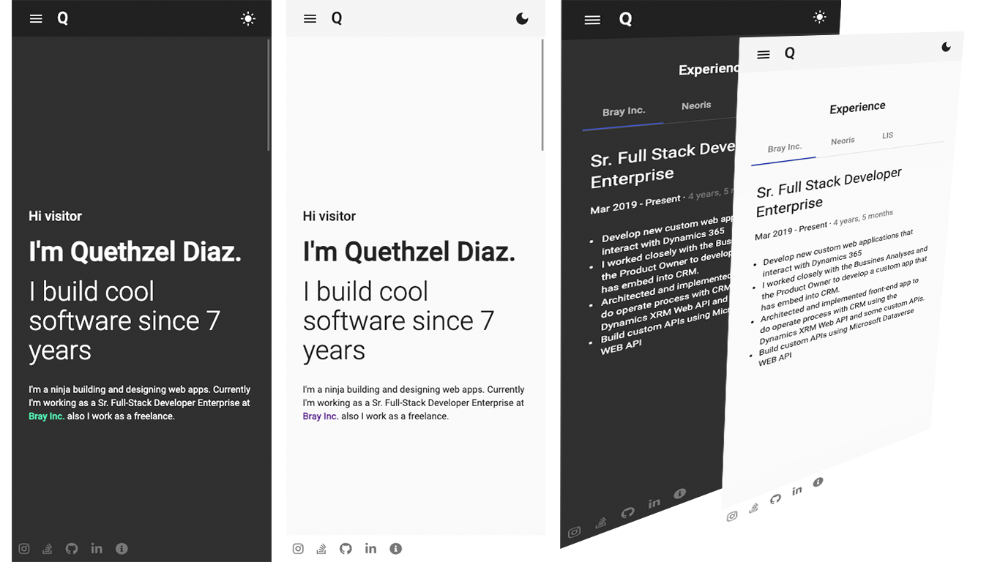

# PowerFolio

Powerfolio is a web responsive portfolio template, build with Angular and Angular Materials. 
You can see a live example at [quethzel.com](https://quethzel.com/)

## Features
- Responsive Design
- Automatic Light/Dark Theme
- Available Sections
    - Hero
    - About Me
    - Experience
    - Contact 
    - Social media links and Google Maps

## Build with
- Angular
- Google Materials
### How To Run In Local?

Run `ng serve`. Navigate to `http://localhost:4200/`. The app will automatically reload if you change any of the source files.

### Automatic Theme According to Schedule
You can define the time from which **Dark Mode** will be activated using the method `isNightTime` in the `core.service file`. By default is setting to be activated from 6:00 PM to 6:00 AM

### Deploy To GitHub Pages
- Run `ng deploy --base-href=https://youraccount.github.io/your-repository/` to deploy under github pages domain.

- Run `ng deploy --cname=yourdomain.com`to deploy under your custom domain.

- [Here](https://jinnabalu.medium.com/godaddy-domain-with-github-pages-62aed906d4ef) you can get a useful post about how integrate GoDaddy domain with GitHub Pages.

## Contact Info

* **Email:** [quethzel@gmail.com](mailto:quethzel@gmail.com)

## Screnshoots

